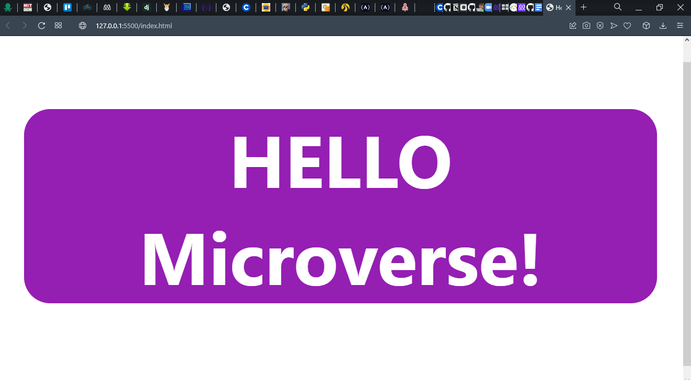

# Hello World

> First project at Microverse.

## Built With

- HTML
- CSS
- JavaScript

## Getting Started

**This is an example of how you may give instructions on setting up your project locally.**
**Modify this file to match your project, remove sections that don't apply. For example: delete the testing section if the currect project doesn't require testing.**

## Authors

👤 **Author**

- GitHub: [@JackMwisa](https://github.com/JackMwisa)
- Twitter: [@JackMwisa](https://twitter.com/jackmwisa)
- LinkedIn: [@JackMwisa](https://www.linkedin.com/in/jack-mwisa-3a6203216/)

## Show your support

Give a ⭐️ if you like this project!

## Acknowledgments

- Hat tip to anyone whose code was used
- Inspiration
- etc

